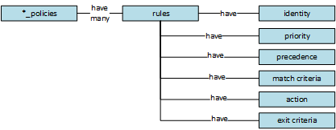

# Policies

Fundementally, policies are collections of rules.  And rules are all structurally the same.

## Rules

### Identity

* This value should be assigned by the creator of the rule.  If you must have a machine-assigned identity, then provide a creator-controlled identity to acompany it.  Example:  the rule has a uuid assigned as the primary key in the database, but the rule has both a "name" and a "link" field that can be easily used to display and interact with the rule content.

table identity:

|id|name|link|description|
|---|---|---|---|
|52a65b1f-95ac-426b-a080-5bacbde0b7ec|rfc1918-drop|https://rules.example.com/rfc1918-drop |This rule matches any IPv4 address in the reserved space as identified by IETF RFC 1918 and drops the packet|

### Priority

* The priority field determines the order of the rules relative to one another in a stack
* The priority value is a positive integer
* Priority values are measured relative to zero.  Closer to zero is higher priority.

### Precedence

* The precedence field determines the order of rules with the same priority relative only to one another as a subset in a stack
* The precedence field is a positive integer
* Precedence values are measured relative to zero.  Closer to zero is higher precedence.

### Match Criteria

* The match criteria field determines whether or not a rule applies to a given subject 
* Implementations MAY allow conjunctive matches, eg. `criteria 1 AND criteria 2` 
* Implementations MAY allow disjunctive matches, eg. `criteria 1 OR criteria 2`
* Implementations MAY allow joint denial matches, eg. `NEITHER criteria 1 NOR criteria 2 `(NOR)
* Implementations MAY allow exclusive disjunctive matches, eg. `EITHER criteria 1 OR criteria 2 but not both` (XOR)
* Implementations MAY allow alternative denial matches, eg. `not both criteria 1 AND criteria 2 at the same time` (NAND)
* Implementations MAY allow negation of matches, eg. `NOT criteria 1`

### Action

* The action field determines what action is taken if a rule applies to a given subject
* Implementations SHOULD only allow one action per match.
* Implementations MAY allow multiple rules with identical matches to have different actions.
* Implementations MUST use the priority, precedence, and exit criteria fields when evaluating multiple rules with identical matches but different actions.

### Exit Criteria

* The exit criteria field determines whether or not the processing of rules should continue when a match is made.  By default, all rules in a policy are evaluated for each subject and if more than one match is made, the matching rule with the priority closest to 1 is executed.  If there are more than one rule at that priority, then the rule with the prority closest to 1 and the precedence farthest from zero is selected.  It is also possible to have several matches and export the decision about which rule should apply to an external application.

| Exit Criteria | Description |
|---|---|
|required| When failing to match the rule, execution continues, but the policy returns a failure status. |
|requisite|When failing to match the rule, the entire policy is exited with a failure status. |
|optional|When matching the rule, continue processing the policy until done or an egress criteria is met (this is the default). |
|sufficient|When successfullly matching the rule, if the action implies the end of processing (with a `return` or `exit` command) then all remaining rules of equal priority are skipped. |
